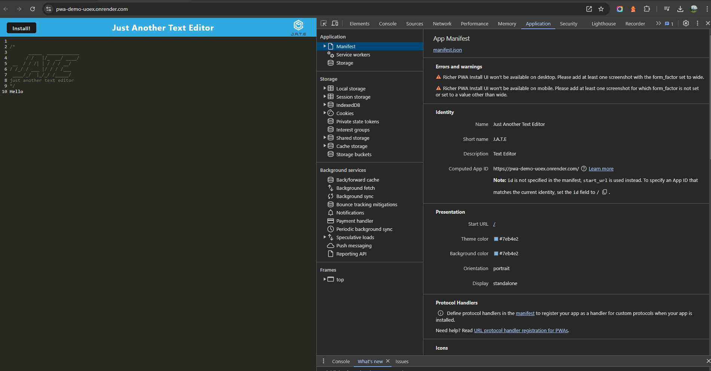
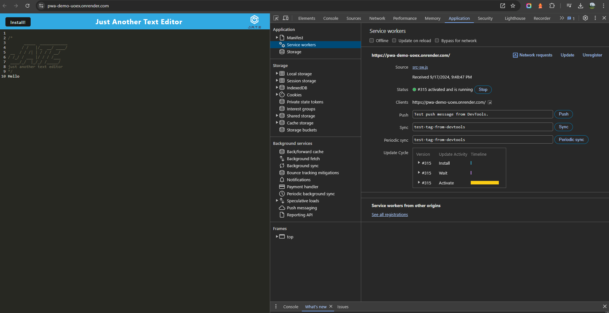
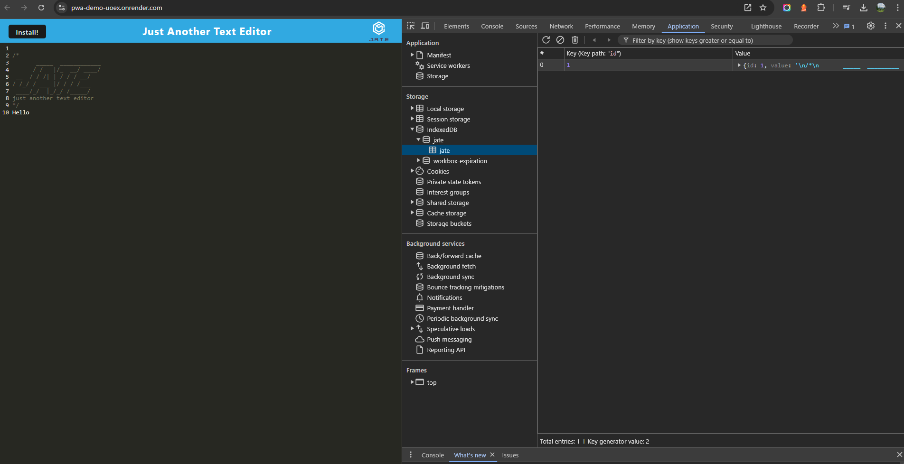

# Pwa Challenge

## What was the purpose?

The purpose of this challenge was to modify the give starter code so that a user can create notes or code snippets with or without an internet connection.

## How was this accomplished?

## Screenshots

### Manifest

### Service Worker

### IndexedDb

## Links

[LiveUrl](https://pwa-demo-uoex.onrender.com)

[GitHub](https://github.com/Bryson987081/pwa-challange)
